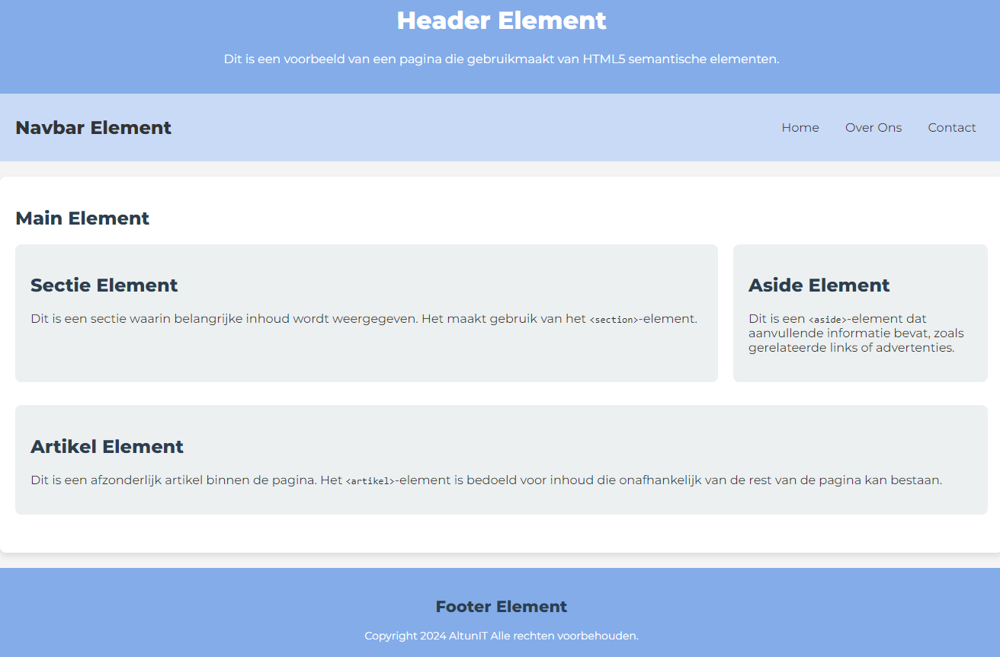

# AltunIT | Semantische Elementen

## Samen aan de slag met semantische HTML

In deze oefening gaan we aan de slag met het correct gebruiken van semantische HTML-elementen om de structuur en betekenis van een webpagina te verbeteren. We richten ons op elementen zoals header, nav, main, section, article, aside, en footer. Hoewel er wat CSS-styling is toegevoegd om de pagina visueel aantrekkelijk te maken, ligt de focus nu op het begrijpen van de HTML-structuur. De CSS is puur ter illustratie, dus daar hoef je nog niet op te letten.

## Wat gaan we doen?

- Stap 1: Plaats de juiste HTML-semantele tags om de pagina logisch op te bouwen.
- Stap 2: Creëer overzichtelijke secties voor elk onderdeel van de pagina met de juiste semantische elementen.
- Stap 3: Bekijk het resultaat en begrijp de rol van elk element. De styling met CSS wordt in een later hoofdstuk behandeld; voor nu ligt de nadruk op het structureren van de HTML.

## Hoe kun je meedoen?
1. Clone deze repository naar je lokale omgeving om de oefenopdracht te volgen:
git clone https://github.com/Altun-IT/HTML-Semantische-Elementen-Oefenopdracht.git
2. Open het bestand index.html in Visual Studio Code.
3. Volg de video en plaats de juiste HTML-elementen om de basisstructuur van de pagina op te bouwen.

## Inhoud van de Webpagina
Tijdens deze oefening werk je met de volgende HTML-elementen:

- Header: Voor de titel en een introductie van de pagina.
- Nav: Voor de navigatielinks naar verschillende delen van de pagina.
- Main: Voor de kerninhoud van de pagina.
- Section: Om inhoud in logische secties te groeperen.
- Aside: Voor aanvullende informatie, zoals gerelateerde links.
- Article: Voor onafhankelijke stukken inhoud zoals artikelen of blogposts.
- Footer: Voor informatie aan het einde van de pagina, zoals contactgegevens of copyright.

## Opdrachtomschrijving
Het doel van deze oefening is om inzicht te krijgen in de functie van semantische elementen en hoe je deze kunt gebruiken om structuur aan te brengen. CSS-styling is toegevoegd om de pagina visueel aantrekkelijk te maken, maar we richten ons nu op de structuur. Focus op het correct plaatsen van de HTML-elementen; de opmaak komt in een later stadium aan bod.

## Eindresultaat
Na het toevoegen van de HTML-elementen heb je een gestructureerde pagina die duidelijk is opgedeeld in semantische secties. Hoewel de pagina er aantrekkelijk uitziet door de styling, ligt de echte kracht in de semantische indeling. Dit helpt om de pagina toegankelijker te maken en geeft zoekmachines en ontwikkelaars een beter begrip van de inhoud.

## Tips voor Beginners
- Volg de video stap voor stap en pauzeer indien nodig om de HTML-code goed te begrijpen.
- Probeer eerst de structuur op te bouwen zonder te focussen op de opmaak. 
- Als je vragen hebt, raadpleeg de HTML-documentatie of kijk opnieuw naar de video voor verduidelijking.
